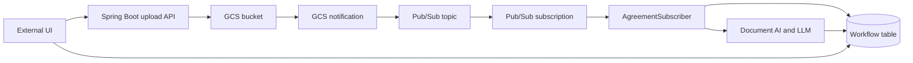

# GCP Free-Tier Setup

This guide provisions the Google Cloud resources required by the Credit Agreement AI backend.

> Important: Google Cloud requires a billing account for the Free Trial and many APIs. New accounts may receive promotional credits for a limited period, but Document AI, Gemini/Vertex AI, storage, and network usage can create charges after credits or free quotas are exhausted. Set a budget alert before testing.

## Architecture


The setup creates this event path:



## Values Used by This Project

Use your own project and resource names where possible. The application currently expects these values:

| Resource | Current value |
| --- | --- |
| Spring Cloud project | `hackathon26-509004` |
| Document AI project | `825071657292` |
| GCS bucket | `credit_aggrement_bucket` |
| Pub/Sub subscription | `credit-agreement-upload-topic-sub` |
| Document AI location | `asia-south1` |
| Document AI processor ID | `d014d4c7a89929da` |
| Credential file | `src/main/resources/hackathon26-credentials.json` |

For a new setup, prefer one project for all resources. If the existing Document AI processor belongs to a different project, either keep the separate project and grant access across projects or create a new processor in the application project.

## 1. Create a Free-Tier Account and Project

1. Open the [Google Cloud Console](https://console.cloud.google.com/).
2. Create or select a Google account.
3. Start the Google Cloud Free Trial if it is offered for the account.
4. Create a new project, for example `credit-agreement-ai-dev`.
5. Open **Billing** and link the project to the billing account.

The Free Trial is not the same as a permanently free account. Stop services and delete test resources when finished.

## 2. Enable Required APIs

In **APIs & Services** -> **Library**, enable:

- Cloud Storage
- Google Cloud Storage JSON API
- Cloud Pub/Sub API
- Cloud Document AI API

## 3. Create the GCS Bucket

1. Open **Cloud Storage** -> **Buckets** -> **Create**.
2. Use a globally unique bucket name.
3. Choose **Uniform access control**.
4. Choose a location, such as `US`, if it is appropriate for your data.
5. Do not make the bucket public.
6. Create the bucket.

The upload code adds `uuid` and `username` as object metadata. Do not expose the bucket publicly; the backend service account should be the only reader/writer.

## 4. Create Pub/Sub Topic and Subscription

The topic receives object-created notifications from GCS. The subscription is consumed by this application.

1. Open **Pub/Sub** -> **Topics** -> **Create topic**.
2. Create `credit-agreement-upload-topic`.
3. Create a subscription named `credit-agreement-upload-topic-sub` on that topic, if not created automatically
4. Keep message retention and acknowledgement defaults for development.

## 5. Create Runtime Permissions

For local development, create a dedicated service account:

1. Open **IAM & Admin** -> **Service Accounts** and select the application project.
2. Select **Create service account**.
3. Enter `credit-agreement-ai` as the service-account name and `Credit Agreement AI Deal Creation` as the description.
4. Select **Create and continue**.
5. In **Grant this service account access to project**, add **Pub/Sub Subscriber** and **Document AI API User**.
6. Select **Continue**.
7. For bucket access, open **Cloud Storage** -> **Buckets** -> `YOUR_BUCKET_NAME` -> **Permissions** -> **Grant access**. Add the service account email and select **Storage Object Admin**.
8. Save each change.

## 6. Create the GCS Notification

If the bucket's **Notifications** tab or **Create notification** action is not available, use the Google Cloud CLI from PowerShell. The following commands use the values currently configured in this project:

```powershell
$PROJECT_ID = "hackathon26-509004"
$BUCKET = "credit_aggrement_bucket"
$TOPIC = "credit-agreement-upload-topic"
$SUBSCRIPTION = "credit-agreement-upload-topic-sub"

gcloud auth login
gcloud config set project $PROJECT_ID

gcloud storage buckets notifications create "gs://$BUCKET" `
  --topic="projects/$PROJECT_ID/topics/$TOPIC" `
  --event-types=OBJECT_FINALIZE `
  --payload-format=json
```

If a topic or subscription already exists, the corresponding `create` command can report an `ALREADY_EXISTS` error; continue with the IAM and notification commands. To inspect the result:

```powershell
gcloud storage buckets notifications list "gs://$BUCKET"
gcloud pubsub topics get-iam-policy $TOPIC
gcloud pubsub subscriptions describe $SUBSCRIPTION
```

The equivalent Console flow, when available in UI is:

1. Open **Cloud Storage** -> **Buckets** and select `YOUR_BUCKET_NAME`.
2. Open the **Notifications** tab.
3. Select **Create notification**.
4. Enter a notification name, such as `agreement-upload-notification`.
5. For the destination, select **Cloud Pub/Sub topic**.
6. Select the application project and the `credit-agreement-upload-topic` topic.
7. Select the object event **Object finalized**. This fires when an upload completes.
8. Select **JSON** as the payload format and leave the optional prefix/suffix filters empty unless the application only processes a specific path.
9. Select **Create**.
10. Return to the bucket's **Notifications** tab and confirm the notification is listed and points to `credit-agreement-upload-topic`.

This notification is the **publisher**. The Spring Boot application does not publish the event; it only subscribes to `credit-agreement-upload-topic-sub`.

## 7. Create a Document AI Processor

1. Open **Document AI** in the Google Cloud Console.
2. Select the same project used by the application, unless you intentionally use a separate Document AI project.
3. Choose **Processor Gallery** -> select the appropriate document/OCR processor.
4. Create the processor in the desired location.
5. Copy the processor ID from the processor details page.
6. Record the processor location and project ID.

Update these values in `src/main/resources/application.yaml`:

```yaml
google:
  document-ai:
    project-id: YOUR_DOCUMENT_AI_PROJECT_ID
    location: YOUR_PROCESSOR_LOCATION
    processor-id: YOUR_PROCESSOR_ID
```

Document AI is not generally covered by an unlimited free tier. Test with small documents and monitor billing.

## 8. Configure Local Credentials

The current application loads the credential file configured here:

```yaml
google:
  document-ai:
    credentials: hackathon26-credentials.json
```

For local-only development, create and download a key from the Google Cloud Console:

1. Open **IAM & Admin** -> **Service Accounts** and select the application project.
2. Select `credit-agreement-ai`.
3. Open the **Keys** tab and select **Add key** -> **Create new key**.
4. Select **JSON** and select **Create**. The browser downloads the key once; Google does not provide the same private key again.
5. Rename the downloaded file to `hackathon26-credentials.json` and place it at `src/main/resources/hackathon26-credentials.json`.

Place the file where the application can load it from the classpath, or change the application configuration to use an external path.

**Never commit the JSON key.** Add the credential filename to `.gitignore`, rotate it immediately if it is exposed, and prefer Application Default Credentials or Workload Identity outside local development.

## 9. Update Application Configuration

Update `src/main/resources/application.yaml`:

```yaml
spring:
  cloud:
    gcp:
      project-id: YOUR_PROJECT_ID

google:
  document-ai:
    project-id: YOUR_DOCUMENT_AI_PROJECT_ID
    location: YOUR_PROCESSOR_LOCATION
    processor-id: YOUR_PROCESSOR_ID
    credentials: hackathon26-credentials.json
  pubsub:
    subscription: YOUR_SUBSCRIPTION_NAME
  bucket:
    name: YOUR_BUCKET_NAME
```

The application currently uses an H2 in-memory database, so no Cloud SQL instance is required for local development.

## 10. Configure Local Runtime Variables

Get the `GOOGLE_API_KEY` from Google AI Studio:

1. Open the [Google AI Studio API keys page](https://aistudio.google.com/app/apikey) and sign in with your Google account.
2. Select **Create API key**.
3. Select an existing Google Cloud project or create a project when prompted.
4. Copy the generated key immediately and store it in a local password manager or other secure location.

Do not paste the key into source code, `application.yaml`, `GCP_SETUP.md`, or commit it to Git. Rotate or delete the key from Google AI Studio if it is exposed.

Set the `GOOGLE_API_KEY` environment variable before starting the application. Replace the placeholder with the key from Google AI Studio:

In PowerShell:

```powershell
$env:GOOGLE_API_KEY = "YOUR_GOOGLE_API_KEY"
```

When running from an IDE, add the following VM option to the run configuration:

```text
-Dprompt.path=D:\Projects\agentic-ai\hackathon26-poc\src\main\resources\prompts
```

For a terminal run, pass the same option through Maven:

```powershell
.\mvnw.cmd spring-boot:run "-Dspring-boot.run.jvmArguments=-Dprompt.path=D:\Projects\agentic-ai\hackathon26-poc\src\main\resources\prompts"
```

The environment variable applies only to the current PowerShell session. Set it again in a new terminal, or configure `GOOGLE_API_KEY` in the IDE run configuration's environment variables.

## 11. Verify the Complete Flow

Start the application:

```powershell
.\mvnw.cmd spring-boot:run "-Dspring-boot.run.jvmArguments=-Dprompt.path=D:\Projects\agentic-ai\hackathon26-poc\src\main\resources\prompts"
```

Upload a small test PDF using the application's web UI or an HTTP client such as Postman. Send a `POST` request to `http://localhost:8080/workflow/upload` as `multipart/form-data` with these fields:

- `uuid`: `workflow-123`
- `username`: `ops-user`
- `file`: the test PDF

Verify each boundary:

1. Confirm the PDF exists in the GCS bucket.
2. Open **Pub/Sub** -> `credit-agreement-upload-topic-sub` and check that messages are being acknowledged.
3. Check application logs for `Received Pub/Sub payload`.
4. Check the `workflow` table for the workflow UUID.
5. Confirm the status progresses through `UPLOADED`, `PARSED`, `EXTRACTED`, `VALIDATED`, `REVIEWED`, and `HUMAN_REVIEW_PENDING`.
6. Inspect `metadata` for the latest serialized result.

## Cleanup

Delete development resources from the Google Cloud Console when finished:

1. Open **Cloud Storage** -> **Buckets**, select `YOUR_BUCKET_NAME`, open **Objects**, select all objects, choose **Delete**, then return to the bucket list and delete the bucket.
2. Open **Pub/Sub** -> **Subscriptions**, select `credit-agreement-upload-topic-sub`, choose **Delete**, and confirm.
3. Open **Pub/Sub** -> **Topics**, select `credit-agreement-upload-topic`, choose **Delete**, and confirm.
4. Open **IAM & Admin** -> **Service Accounts**, select `credit-agreement-ai`, choose **Delete**, and confirm.
5. Delete the project from **IAM & Admin** -> **Settings** only if it contains no resources you need.

