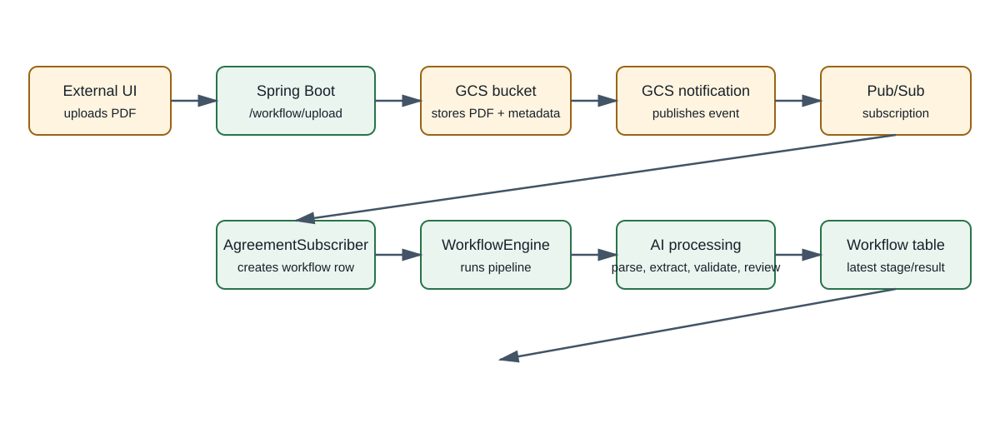

# Credit Agreement AI

Spring Boot proof of concept for turning credit agreement PDFs into structured deal data.

## Architecture



The flow is split into three phases:

1. **Upload and publish**
  - An external UI uploads a PDF to `POST /workflow/upload`.
   - The application stores the PDF and `uuid`/`username` metadata in Google Cloud Storage.
   - GCS detects the new object and an external notification publishes an object-created event to Pub/Sub.

2. **Subscribe and start**
   - This application subscribes to `agreement-upload-sub`.
   - `PubSubListener` forwards the message to `AgreementSubscriber`.
   - `AgreementSubscriber` reads the GCS event, creates the initial workflow row with status `UPLOADED`, and starts the workflow.

3. **Process and poll**
   - The workflow reads the PDF from GCS, processes it with Google Document AI and the LLM, validates and reviews the extracted deal, and persists each stage.
  - The external UI is expected to poll the workflow table and read the latest status and deal data.

Current status progression:

```text
UPLOADED -> PARSED -> EXTRACTED -> VALIDATED -> REVIEWED -> HUMAN_REVIEW_PENDING
```

`DEAL_CREATED` is defined but is not currently reached by the application.

## Upload API

```http
POST /workflow/upload
Content-Type: multipart/form-data
```

Parameters:

- `uuid`: workflow identifier
- `username`: user identifier
- `file`: PDF document

Example:

```bash
curl -X POST http://localhost:8080/workflow/upload \
  -F "uuid=workflow-123" \
  -F "username=ops-user" \
  -F "file=@/path/to/agreement.pdf"
```

The immediate response confirms the GCS upload. It does not contain the final deal result:

```text
File uploaded successfully: gs://<bucket>/<object-name>
```

## Configuration

Main configuration is in `src/main/resources/application.yaml`:

```yaml
google:
  bucket:
    name: loaniq-agreement
  pubsub:
    subscription: agreement-upload-sub
```

GCS notifications, the Pub/Sub topic, and the topic-to-subscription connection must be configured in Google Cloud outside this application. The application credentials must have access to GCS, Pub/Sub, and Document AI.

## Persistence

The workflow is stored in the `workflow` table. Each processing stage updates the workflow status and serialized metadata. The `workflow_event` table records agent execution status, duration, and retry information.

The external UI is expected to read the latest workflow row from the database. This repository contains only the backend; it has no UI implementation, polling code, or separate workflow-result endpoint.

## Run Locally

```bash
./mvnw spring-boot:run
```

On Windows:

```powershell
.\mvnw.cmd spring-boot:run
```

The application runs on port `8080` by default.

## Technology

- Java 17
- Spring Boot 3.1.0
- Google Cloud Storage and Pub/Sub
- Google Document AI
- Google ADK / LLM extraction
- Spring Data JPA
- H2 database for local development
