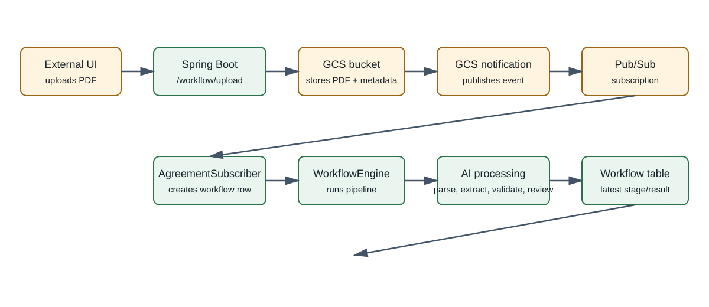

# Credit Agreement AI

Spring Boot proof of concept for turning credit agreement PDFs into structured deal data.

## Architecture



The flow is split into three phases:

1. **Upload and publish**
  - An external UI uploads a PDF to `POST /workflow/upload`.
   - The application stores the PDF and `uuid`/`username` metadata in Google Cloud Storage.
   - GCS detects the new object and an external notification publishes an object-created event to Pub/Sub.

2. **Subscribe and start**
   - This application subscribes to `agreement-upload-sub`.
   - `PubSubListener` forwards the message to `AgreementSubscriber`.
   - `AgreementSubscriber` reads the GCS event, creates the initial workflow row with status `UPLOADED`, and starts the workflow.

3. **Process and poll**
   - The workflow reads the PDF from GCS, processes it with Google Document AI and the LLM, validates and reviews the extracted deal, and persists each stage.
  - The external UI is expected to poll the workflow table and read the latest status and deal data.

Current status progression:

```text
UPLOADED -> PARSED -> EXTRACTED -> VALIDATED -> REVIEWED -> HUMAN_REVIEW_PENDING -> HUMAN_REVIEW_COMPLETED
```

`DEAL_CREATED` is defined but is not currently reached by the application.

## Upload API

```http
POST /workflow/upload
Content-Type: multipart/form-data
```

Parameters:

- `uuid`: workflow identifier
- `username`: user identifier
- `file`: PDF document

Example:

```bash
curl -X POST http://localhost:8080/workflow/upload \
  -F "uuid=workflow-123" \
  -F "username=ops-user" \
  -F "file=@/path/to/agreement.pdf"
```

The immediate response confirms the GCS upload. It does not contain the final deal result:

```text
File uploaded successfully: gs://<bucket>/<object-name>
```

## Workflow Polling API

The UI polls the database-backed workflow record after upload:

```http
GET /workflow/{uuid}/status
```

The response includes `uuid`, `status`, `nextAgent`, `username`, `updatedAt`, `completedAt`, and `failureReason`. If an agent event failed, it also includes `eventStatus`, `failedAgent`, and `eventFailureReason` from the latest failed `workflow_event`. A workflow that has not yet been created returns `404`.

When the workflow reaches `HUMAN_REVIEW_PENDING`, the UI loads the persisted extraction response:

```http
GET /workflow/{uuid}/metadata
```

The response is the stored extraction JSON, including `workflowId`, `deal`, validation issues, review issues, and overall confidence. The endpoint returns `404` for an unknown workflow and `409` while output is not ready.

After all returned fields are approved, the UI submits the review decisions:

```http
POST /workflow/{uuid}/sign-off
Content-Type: application/json
```

The request includes the review output and `reviewedFields`, whose entries must all have status `APPROVED`. The backend stores this payload in `human_output`, marks the `HUMAN_REVIEW` workflow event `SUCCESS`, clears `next_agent`, and updates the workflow to `HUMAN_REVIEW_COMPLETED` with `completed_at` set. The endpoint returns `409` if the workflow is not awaiting review and `400` if the submitted review is incomplete or contains unapproved fields.

For local development, the frontend defaults to `http://localhost:8080`. Set `VITE_API_BASE_URL` to override the backend origin.

## Configuration

Main configuration is in `src/main/resources/application.yaml`:

```yaml
google:
  bucket:
    name: loaniq-agreement
  pubsub:
    subscription: agreement-upload-sub
```

GCS notifications, the Pub/Sub topic, and the topic-to-subscription connection must be configured in Google Cloud outside this application. The application credentials must have access to GCS, Pub/Sub, and Document AI.

## Persistence

The workflow is stored in the `workflow` table. Each processing stage updates the workflow status and serialized metadata. The `workflow_event` table records agent execution status, duration, and retry information.

The workflow status and metadata endpoints expose the latest workflow row to the UI. Review sign-off is persisted through the sign-off endpoint; deal creation is not implemented by this backend.

## Run Locally

```bash
./mvnw spring-boot:run
```

On Windows:

```powershell
.\mvnw.cmd spring-boot:run
```

The application runs on port `8080` by default.

## Technology

- Java 17
- Spring Boot 3.1.0
- Google Cloud Storage and Pub/Sub
- Google Document AI
- Google ADK / LLM extraction
- Spring Data JPA
- H2 database for local development
